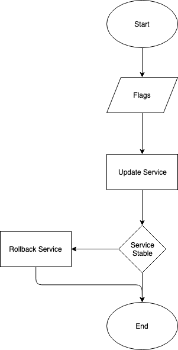
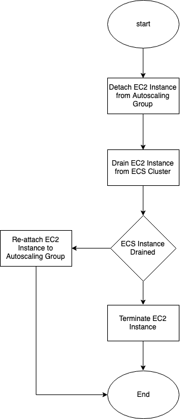

# go-awsecs

Library and tools for AWS ECS operations.

# contributing

See [CONTRIBUTING.md](CONTRIBUTING.md).

# tools

## update-aws-ecs-service

Reliably update a single ECS service with a single simple discrete command.



Is a deployment tool inspired by
[AWS CodePipeline image definitions file method for updating existing ECS services](https://docs.aws.amazon.com/codepipeline/latest/userguide/pipelines-create.html#pipelines-create-image-definitions).
This tool is first and foremost an acknowledgment that orchestrating application deployments is a **hard problem** and
does not attempt to solve that, instead, it tries to do something similar to AWS CodePipeline in a standalone fashion
without depending on AWS CodePipeline, and more importantly without having to create individual AWS CodePipeline
pipelines.

Get:

Grab binary distribution from [releases tab](https://git.autodesk.com/t-villa/go-awsecs/releases). Or.

```
go get -v -u git.autodesk.com/t-villa/go-awsecs/cmd/update-aws-ecs-service
```

Use<sup>1</sup>:

```
update-aws-ecs-service --help
Usage of update-aws-ecs-service:
  -cluster string
    	cluster name
  -container-envvar value
    	container-name=envvar-name=envvar-value
  -container-image value
    	container-name=image
  -container-secret value
    	container-name=secret-name=secret-valuefrom
  -desired-count int
    	desired-count (negative: no change) (default -1)
  -profile string
    	profile name
  -region string
    	region name
  -service string
    	service name
  -taskdef string
    	base task definition (instead of current)
```

Example.

First, build and push a new Docker image for your service somewhere else.

```
docker build -t myrepo/myimg:newtag .
docker push myrepo/myimg:newtag
```

Then, alter the existing container image only, like AWS CodePipeline does.

```
update-aws-ecs-service \
  -cluster mycluster \
  -service myservice \
  -container-image mycontainer=myrepo/myimg:newtag
```

Alternatively, you can also alter environment variables and service desired count.

```
update-aws-ecs-service \
  -cluster mycluster \
  -service myservice \
  -container-image mycontainer=myrepo/myimg:newtag \
  -container-envvar mycontainer=envvarname=envvarvalue \
  -desired-count 1
```

💡 Use the empty value on `-container-envvar` or `-container-secret` to unset (K.O.) the environment variable or
secret. Example.

```
update-aws-ecs-service \
  -cluster mycluster \
  -service myservice \
  -container-envvar mycontainer=myenvvarname= \
  -container-secret mycontainer=mysecretname= \
```

### update-aws-ecs-service compared to AWS CodePipeline

 - With `update-aws-ecs-service` there is no need to create individual AWS CodePipeline pipelines per service
 - `update-aws-ecs-service` allow updates of container definitions "Environment" and
   "[Secrets](https://aws.amazon.com/about-aws/whats-new/2018/11/aws-launches-secrets-support-for-amazon-elastic-container-servic/)"

### update-aws-ecs-service compared to AWS CLI

Although similar results can be achieved glueing multiple `awscli` commands, a single `update-aws-ecs-service` is
different.

 - `aws ecs update-service` only invokes `UpdateService` which is an async call
 - `aws ecs wait services-stable` is not linked to the ECS Deployment Entity<sup>2</sup> returned by `UpdateService`
 - `update-aws-ecs-service` provides automatic rollback

### update-aws-ecs-service compared to Terraform

It is a [known issue](https://github.com/terraform-providers/terraform-provider-aws/issues/3107) that Terraform, does
not wait for an ECS Service to be updated, a decision made probably by design by Hashicorp.

However, `update-aws-ecs-service` can be used in conjunction with Terraform, just keep in mind that when
**provisioning** a service, start with an "initial task definition", and configure the lifecycle of the
`task_definition` attribute to `ignore_changes`.

```
resource "aws_ecs_service" "my_service" {
  task_definition = "my_initial_task_def"
  // ...

  lifecycle {
    ignore_changes = ["task_definition" /* ... */]
  }
}
```

That way Terraform will be maintained as the "provisioning tool" and `update-aws-ecs-service` as the "deployment tool".

### update-aws-ecs-service compared to Terraform+scripts

 - Why not just do `aws ecs wait services-stable` commands after the `terraform apply` command

   Caveat 1: `wait` evaluates service stability but not that the desired deployment is applied the service may have become
   stable because it was rolled back or rolled forward somewhere else, there is no certainty that "our" deployment was
   the one that rendered the service stable
   
   Caveat 2: `wait` does not handle service deployment rollback

 - Why not just do `curl|httpie` commands after the `terraform apply` command until a desired result is obtained
   probably after a number of times, for example by looking at an endpoint that returns the "deployed version" like:
   http://myservice.example.com/api/version returns `{"version": "v2.0.0"}`

   Caveat 1: This works only for services which are public (internet reachable) or reachable from the same location
   where `curl|httpie` is executed, this is not always the case, some services are internal or not reachable from every
   location
   
   Caveat 2: Works only for HTTP services that provide a "version" endpoint

### update-aws-ecs-service compared to AWS CodeDeploy

TBC<sup>3</sup>.

### update-aws-ecs-service compared to amazon-ecs-cli

TBC.

### update-aws-ecs-service compared to ecs-deploy

The [ecs-deploy](https://github.com/silinternational/ecs-deploy) script
[doesn't recognize multi-container tasks](https://github.com/silinternational/ecs-deploy/issues/132).

### update-aws-ecs-service compared to ecs-goploy

[ecs-goploy](https://github.com/h3poteto/ecs-goploy) as a re-implementation of ecs-deploy shares the same caveats.

### update-aws-ecs-service compared to Autodesk CloudOS

`update-aws-ecs-service` is not a framework, is just a tool to update existing AWS ECS services. You just need to know
how to build Docker images.

### update-aws-ecs-service compared to X

TBC.

## enforce-aws-ecs-asg-launchconfig




This tool is useful to ensure that all EC2 instances in a ECS cluster backed up by a ASG share the launch configuration
defined in the ASG. This tool does not work with launch templates! ECS EC2 Container Instances will be drained. EC2
Instances will be terminated (after they have been drained).

**Important**: Depending of your cluster service(s) deployment configuration, services **will experiment downtime**.
For example use a service deployment configuration like, "Minimum healthy percent": `100` and "Maximum percent": `200`
to prevent downtime `enforce-aws-ecs-asg-launchconfig` does not do anything special to prevent downtime it depends
entirely of your cluster service(s) specific configuration(s).

Get:

Grab binary distribution from [releases tab](https://git.autodesk.com/t-villa/go-awsecs/releases). Or.

```
go get -v -u git.autodesk.com/t-villa/go-awsecs/cmd/enforce-aws-ecs-asg-launchconfig
```

Use:

```
enforce-aws-ecs-asg-launchconfig --help
Usage of enforce-aws-ecs-asg-launchconfig:
  -asg string
    	asg name
  -cluster string
    	cluster name
  -profile string
    	profile name
  -region string
    	region name
```

Example:

```
enforce-aws-ecs-asg-launchconfig \
  -asg myasgname \
  -cluster myclustername
# default timeout for the operation is 15 minutes
```

----

1. https://unix.stackexchange.com/a/111557/19393
2. https://docs.aws.amazon.com/AmazonECS/latest/APIReference/API_Deployment.html
3. To Be Compared
